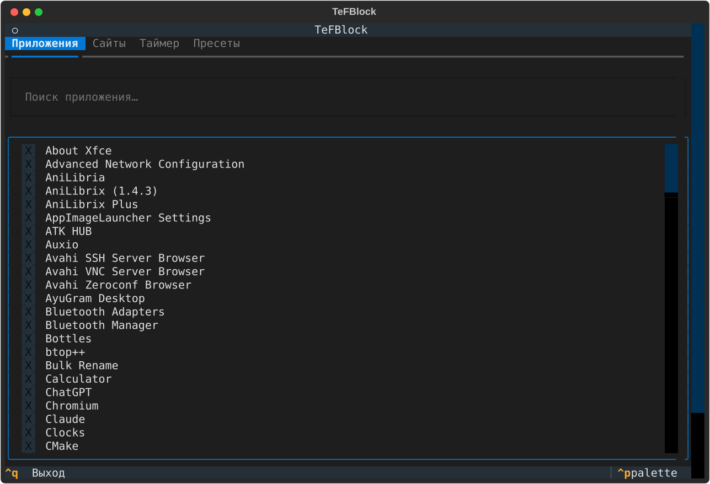
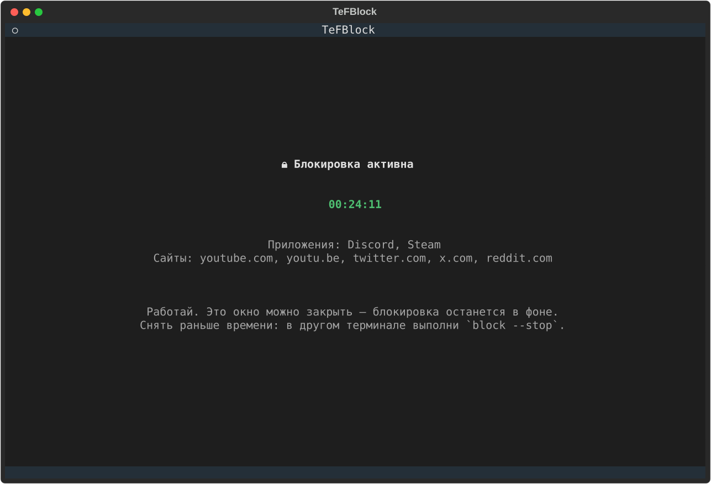

<p align="center">
  
</p>

<p align="center">
  <b>A terminal app &amp; website blocker with a beautiful TUI.</b><br>
  Pick what distracts you, set a timer, and it's gone — even if you close the terminal.
</p>

<p align="center">
  <a href="#installation">Installation</a> ·
  <a href="#usage">Usage</a> ·
  <a href="#preset-commands">Preset commands</a> ·
  <a href="#how-it-works">How it works</a> ·
  <a href="#platform-support">Platform support</a>
</p>

---

## What it does

TeFBlock is built for people who struggle to focus because of social media,
games, or other distracting apps and sites. Run one command, pick what to
block, set a timer, and TeFBlock takes it out of your hands — literally: the
block runs as a background process with elevated privileges, so closing the
terminal (or even your editor, or logging out and back in) does not undo it.
The only sanctioned way to stop early is `block --stop`, which asks for
confirmation and your admin/root password again — enough friction that you
won't do it on autopilot.

| Apps &amp; sites picker | Block in progress |
|---|---|
|  |  |

## Features

- **Full-screen TUI** (built with [Textual](https://textual.textualize.io/)) — search and check off installed apps, add sites by domain or by pasting a link, pick a timer, save presets. A plain-text `--text` mode is also available if a fullscreen TUI ever misbehaves in your terminal.
- **Smart site grouping** — block `youtube.com` and `youtu.be`, `youtube-nocookie.com`, `music.youtube.com`, `googlevideo.com` all get blocked together. Same for Twitter/X, Instagram, TikTok, Reddit, Discord, and a dozen other common distractions — paste any related link and it resolves to the right group.
- **Browser web-apps blocked precisely** — installed Chrome/Edge/Brave/Chromium web-apps (e.g. a YouTube Music or Photopea shortcut) are matched by their specific `--app-id`, not by killing the browser binary — so blocking one web-app never takes down your whole browser.
- **Presets** — save a selection (apps + sites + duration) under a name like `work` or `learn`, then start it instantly with `block work`. You can also install it as its own shell command, so just typing `work` starts it.
- **Survives closing the terminal** — the blocking process detaches into the background (double-fork + new session on Linux/macOS, an independent elevated process on Windows) as soon as it starts.
- **Hard to stop on impulse** — while a block is active, its state file is owned by root/admin, so an unprivileged edit can't cancel it early. The only way out is `block --stop`, which re-prompts for your password and a typed confirmation.
- **Cross-platform** — Linux/macOS and Windows are both supported (see [platform support](#platform-support) for exact capabilities on each).

## Installation

Requires Python 3.10+.

### Linux / macOS

```bash
pipx install "git+https://github.com/mistqkw/tefblock.git"
```

Or, if you want to hack on the code yourself:

```bash
git clone https://github.com/mistqkw/tefblock.git
pipx install --editable ./tefblock
```

If you don't use [`pipx`](https://pipx.pypa.io/), `pip install --user .` from
the cloned directory works too, just make sure your user `bin` directory is
on `PATH`.

> **fish shell users:** `block` is also the name of a built-in fish command
> (used for delaying event handlers), so fish will run its own builtin
> instead of TeFBlock unless you shadow it. Run this once:
> ```fish
> mkdir -p ~/.config/fish/functions
> echo 'function block; command block $argv; end' > ~/.config/fish/functions/block.fish
> ```
> Open a new fish session afterwards. bash/zsh don't have this conflict.

### Windows

```powershell
pip install --user pywin32
pip install --user "git+https://github.com/mistqkw/tefblock.git"
```

Make sure the Python `Scripts` directory (where `block.exe` gets installed)
is on your `PATH` — the Python installer offers to do this automatically if
you tick the box during install. `pywin32` is required on Windows for
scanning Start Menu shortcuts and for the UAC elevation prompt used to start
the block; it's not needed on Linux/macOS.

## Usage

```
block                  Open the full TUI: pick apps/sites, set a timer, confirm.
block --text           Same thing as a plain question-and-answer text prompt.
block work             Instantly start a saved preset named "work".
block --status         Show what's currently blocked and how much time is left.
block --list-presets   List saved presets.
block --stop           End the block early (asks for confirmation + password).
```

Starting a block always shows one last reminder first — put your phone away
and set it to silent — before you confirm and it locks in.

## Preset commands

While saving a preset (in the TUI's "Presets" tab, or at the end of the
`--text` flow), you can also install it as its own shell command. This adds a
small function to your shell profile — `~/.bashrc` / `~/.zshrc` on
Linux/macOS, your PowerShell `$PROFILE` on Windows — so that after a preset
named `work` is installed, you can just type:

```
work
```

instead of `block work`. If a command with that name already exists, TeFBlock
warns you and asks you to confirm before overriding it. Open a new terminal
(or `source ~/.bashrc`, or reload your PowerShell profile) for it to take
effect.

## How it works

- **Sites** are blocked by writing entries to the system hosts file
  (`/etc/hosts` on Linux/macOS, `C:\Windows\System32\drivers\etc\hosts` on
  Windows), redirecting each domain to `127.0.0.1`/`::1`. This works across
  every browser at once, since it's resolved at the OS level.
- **Apps** are blocked by a background process that checks the running
  process list every 2 seconds and terminates matches.
- The blocking process needs elevated privileges to edit the hosts file, so
  it's launched once via `sudo` (Linux/macOS) or a UAC prompt (Windows), and
  then detaches to keep running independently — closing the terminal,
  logging out, or quitting the TUI does not stop it.
- While a block is active, its state file becomes root/admin-owned on
  Linux/macOS so it can't be casually edited to end the block early. Ending
  it early always goes through `block --stop`, which re-elevates to flip a
  flag the background process checks each cycle.
- When the timer runs out, the background process restores the hosts file
  and cleans up on its own — no further action needed.

## Platform support

| | Linux | macOS | Windows |
|---|---|---|---|
| TUI / text mode | ✅ | ✅ (untested, should work) | ✅ |
| Site blocking | ✅ | ✅ (untested, should work) | ✅ |
| App discovery | ✅ `.desktop` files | ✅ (untested) | ✅ Start Menu shortcuts |
| App blocking | ✅ | ✅ (untested) | ✅ |
| Preset shell command | ✅ bash/zsh/fish | ✅ bash/zsh | ✅ PowerShell |
| Elevation | `sudo` | `sudo` | UAC (`pywin32`) |

**Android/Termux is not supported.** Without root, Termux has no way to
change how the rest of the OS resolves DNS or to close other apps' processes
— both are hard Android sandboxing restrictions, not something this project
can work around. There's nothing stopping you from installing it in Termux
to browse the code or hack on it, but actual blocking won't do anything
there.

## Contributing

Issues and pull requests are welcome — Linux is the platform this was
actually tested on end-to-end; Windows support follows the same design but
would benefit from real-world testing and bug reports.

## License

[MIT](LICENSE)
